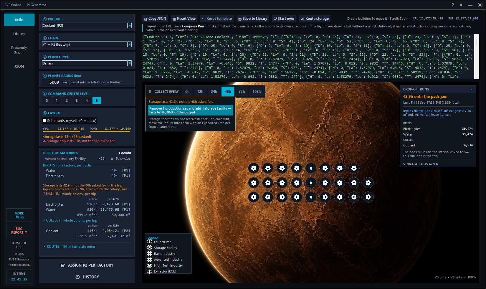
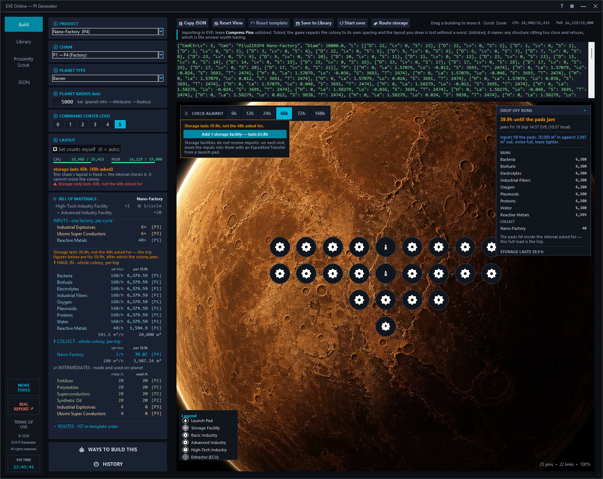
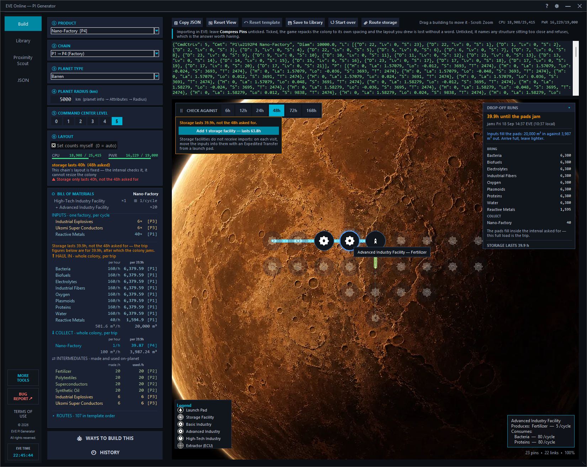
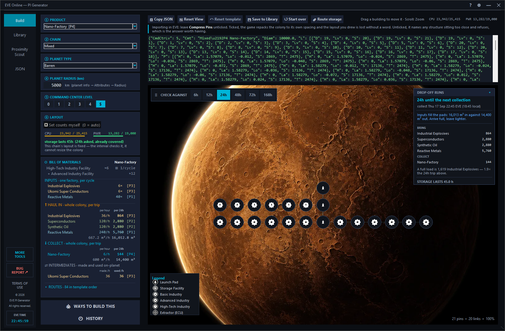
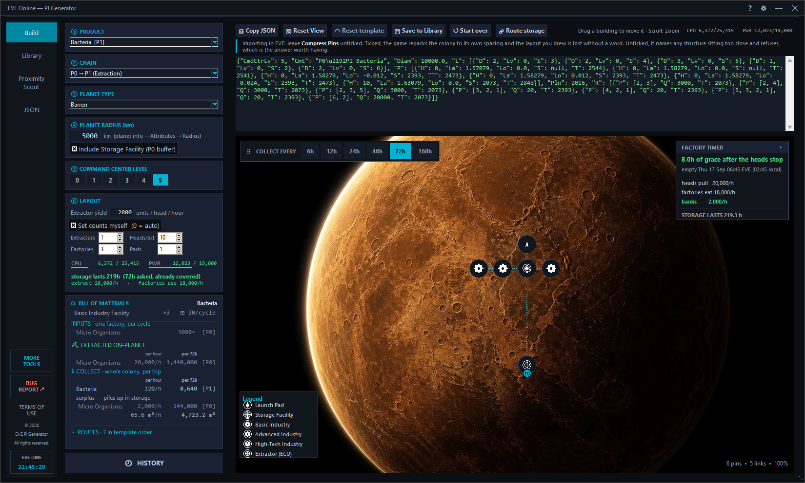
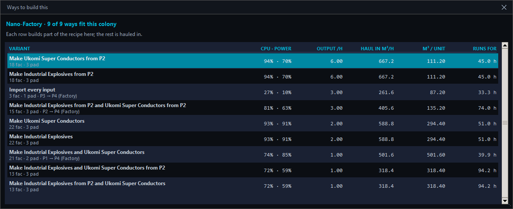
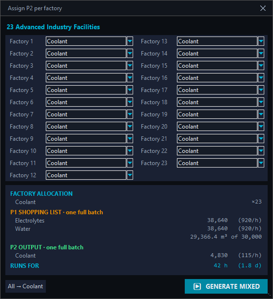
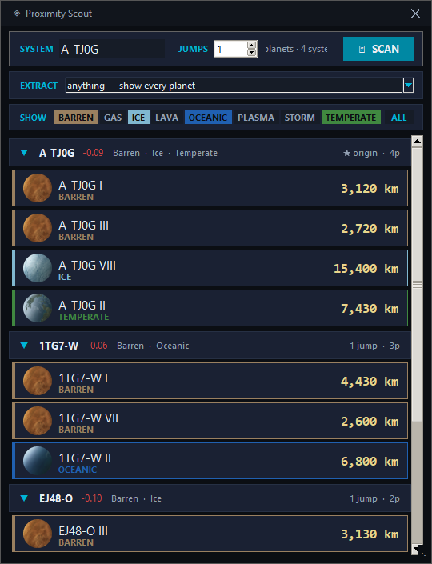
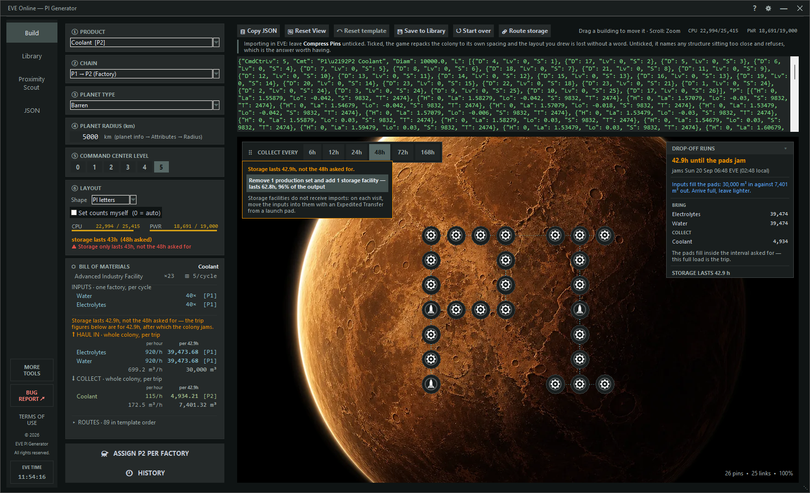

# EVE PI Template Generator

A desktop tool for EVE Online players that generates ready-to-import Planetary Interaction (PI) installation templates. Based on the original spreadsheet by Razkin.

> **Heads-up:** the web version of this tool is where development happens first. Both share the same colony engine — the generators are tested against each other, so a colony both tools can build comes out identical — but new features reach this desktop tool later, and it may run a version or two behind.



## Features

### Building a colony

- **Starts empty** — Nothing is chosen on arrival, and choosing a product does not choose a chain or a planet type for you. A setting you did not pick should not read like one you did
- **No Generate button** — The panel computes a full colony on every change. Pick product, chain and planet type and the colony is drawn, priced and complete
- **One window, two halves** — A compact settings column on the left, the colony it describes on the right. Change a number and watch the planet answer
- **A window that fits itself** — The height follows what there is to show, so a colony is never behind a scrollbar. Only if the screen runs out does the text size step down, in 5% increments and never below a floor — growing the window is always tried first
- **Template Generation** — JSON templates for any PI product (P1–P4) across all planet types and Command Center levels (0–5)
- **Eight Production Chains** — `P0→P1`, `P0→P2`, `P1→P2`, `P1→P3`, `P2→P3`, `P1→P4`, `P2→P4`, `P3→P4`
- **Colonies sized to work, not just to fit** — Factory counts follow what the extractors actually produce and how often you are willing to collect, rather than filling the CPU budget with factories that would starve
- **Material sources** — On `P0→P2`, each P1 input says where it comes from (*"Water — from Aqueous Liquids"*) and can be switched to *haul in*. An input the planet cannot dig is ticked and locked. Hauling both in is simply `P1→P2`, and the chain switches to say so
- **Counters in the units the colony is built in** — On `P0→P2` a factory is a set: each Advanced Industry Facility brings its Basic ones with it, and an extractor set is one extractor per raw material dug. The fields are named *Advanced* and *Ext sets*, and one arrow click adds one whole set
- **Manual override with live validation** — Set exact structure counts yourself, arm length included; the layout panel reports CPU, power, link load, material balance and how long storage lasts instead of silently refusing
- **Nothing is ever stacked** — Every colony the generator can build is checked against EVE's minimum spacing. EVE refuses to import a colony with structures touching, so the generator is the only place that can prevent it
- **Colony shapes** — The same colony, re-laid as a `#`, a star, a grid, a plus, a diamond, a ring, a spiral or the letters *PI*. The list offers only the shapes that colony can actually take, and **Standard** returns the engine's own layout byte for byte
- **Routes that drain the right pad first** — Every factory pulls from its own launch pad before any other, so multi-pad colonies consume in parallel instead of emptying one pad while the rest sit full

### On the planet

- **Visual Preview** — The colony drawn on real planet artwork, at a fixed scale so buildings keep their size no matter how big the colony gets. Cyan links flow along their dashes, extractors wear their head count, and anything placed too close wears a red ring
- **The client's own structure icons** — Launch pads, storage, extractors and the three factory tiers wear the glyph EVE draws in the PI window, tinted white, red when crowded, and pale when a hover fades them. Without them the map falls back to vector glyphs
- **Hover a structure** — Everything unrelated fades, its routes light up in per-commodity colours, its name follows the pointer, and the full detail (what it produces, what it consumes, per cycle) docks in the corner of the map instead of covering the routes you are trying to read
- **Collection interval on the planet** — 6h to 168h, on a draggable bar over the map, because its answer is written there: the drop-off panel and "storage lasts"
- **Drop-off runs / Factory timer** — A floating, foldable panel. For a colony you feed: when the pads jam, in EVE time and local time, and the exact load to bring and to collect. For a colony that mines: how long it keeps producing after the extractor heads stop
- **Supply notice** — When the extractors and the factories disagree, the planet says so in numbers (*"The heads pull 20,000/h and the factories eat 24,000/h"*) with a button that adds or removes exactly the factories — or factory sets — that close the gap
- **Storage suggestion** — When storage runs out before the interval you asked for, the planet offers the fix as a button: *"Add 1 storage facility — lasts 63.8h"*. When no storage facility fits the budget, it offers to trade the fewest production sets for storage, and says what share of the output that keeps. When nothing can be traded, it offers the same product built from the tier above
- **Move structures by hand** — Drag any building on the map; CPU and power update *during* the drag. Crowding is shown, never refused — landing on a neighbour is your call, the same way an over-budget colony is
- **Settings that edit rather than replace** — Radius and Command Center level re-price the colony without moving anything; the counters edit it in place and keep every structure you positioned yourself. Only product, chain and planet type describe a *different* colony, and only those rebuild it
- **Reset template** — Brings back the colony the generator made, dropping moves, added or removed structures and applied suggestions, while keeping every setting in the panel
- **Route storage** — Links every launch pad and storage facility to the factories it can feed. For storage that arrived without routes: an imported colony, or one placed in game
- **Start over** — Empties the planet and returns all six steps to their opening state, asking first only if you have unsaved hand-arranged work

### Reading the numbers

- **Bill of Materials** — One factory's recipe, plus the whole colony's throughput both per hour and **per collection trip** — what it extracts, what you must haul in, what you collect. The per-trip column is the number you load a hauler against, and it is capped at what storage actually survives: ask 48h of a colony that jams at 33 and it says so and computes for 33
- **Intermediates** — What a multi-stage colony makes and uses on the planet, made and used per hour side by side. A pair that differs is the gap that HAUL IN or COLLECT carries
- **Routes table** — Every route in the template, in the order EVE reads them, with its commodity, quantity and the structures it passes through. Folded by default; a P1→P3 colony carries over 90
- **What the game will refuse** — A link over 1,250 m³/h names itself, with the level to upgrade it to in game and what that costs in CPU and power. A route through more than 7 structures is called out in red: EVE builds every other route of the template and silently drops that one
- **Extraction coverage** — When a colony runs more factories than its heads support, the BOM says so in words (*"6 of 7 factories are fed by extraction; the rest need 2,000/h of Planktic Colonies hauled in"*)

### Other ways to build

- **Ways to build this** — For a P3 or P4, every way one planet can build it: which inputs it makes and which a hauler brings. Each row is generated and costed — Command Center load, output per hour, m³ hauled per hour and per unit, how long a full load runs — and clicking one builds it on the planet
- **Assign P2 per factory** — For `P1→P2`, give each Advanced Industry Facility its own P2 on the proven layout: only the schematics and route payloads are rewritten, never the pins, links or route paths. The window opens at the size its content needs, with the factory pickers in two columns on a large colony

### Finding a planet, keeping a colony

- **Proximity Scout** — Scans every system within N jumps and lists their planets with type icons and radii. Runs entirely from a bundled SDE snapshot (8,490 systems, 67,693 PI planets): no network, no ESI outage, a 4-jump scan in under a millisecond. Choose the P1 you mean to extract and the planet filter narrows to the types that carry its raw material. Click any planet to build for it, with its type *and* radius carried across
- **History** — Always on. Every build, every applied suggestion and every hand-made move is recorded, so stopping and coming back is not a decision you have to make in advance
- **Library** — Your own colonies as cards: chain, planet, structure count, save date and a breakdown, all readable without opening anything. Search filters on name and comment. Load, Edit or Delete
- **Opening a template fills the panel** — Product, chain, planet type, radius and Command Center level are derived from the colony itself, never from its file name or comment, so a template from a forum post reads correctly too
- **JSON workspace** — Import from file, paste or clipboard; export by copy or file. Everything lands on the Build stage with the panel filled in
- **Themes and text size** — 23 EVE faction colour schemes, plus a text-size setting (80–200%) that scales every font and the panels drawn around them
- **System Tray** — Minimize to tray; click the icon to restore

## Screenshots

| | |
|---|---|
|  |  |
| **Storage suggestion** — a P1→P4 colony that lasts 39.9h of the 48h asked, and the button that fixes it | **Hover** — the rest of the colony fades, routes light up, details dock in the corner |
|  |  |
| **Ways to build this, applied** — Nano-Factory making its own Ukomi Super Conductors | **P0→P1 extraction** — manual counts, storage buffer and the factory timer |
|  |  |
| **Ways to build this** — every variant, costed side by side | **Assign P2 per factory** — one P2 per Advanced Industry Facility |
|  |  |
| **Proximity Scout** — offline, filtered by planet type | **Shape** — the same 23 factories, re-laid as the letters *PI* |

More in the repository root: the empty Build screen (`1.png`), the JSON workspace (`10.png`), the Scout unfiltered and by extracted P1 (`4.png`, `5.png`), the Library (`9.png`), Settings (`6.png`) and About (`7.png`).

## How colonies are sized

PI has no single correct layout, so the generator does not try to invent one. It
starts from the numbers you control and builds the colony those imply:

- **Extractor yield** (default 2000 units per head per hour). Factory counts are
  derived from this rather than from spare CPU: a Basic Industry Facility
  consumes 6000 units an hour, so a 10-head extractor feeds three of them. Real
  yield depends on deposit richness and program length and decays over a cycle,
  so this is a planning assumption, not a game constant.
- **Collection interval** (6 / 12 / 24 / 48 / 72 / 168 hours). Launch pads hold
  10,000 m³ each and must cover both the inputs waiting to be consumed and the
  outputs piling up. On extraction chains the generator sizes the launch pads
  for the interval. Factory colonies (`P1→P2`, `P2→P3`,
  `P3→P4`) are built to what the Command Center fits and are never cut down to
  meet it: when their storage falls short, the planet says by how much and the
  storage suggestion offers the trade, so the choice stays yours. If a colony
  already lasts, the panel says "already covered".
- **Planet radius**. Link CPU and power scale with link length, and structures
  sit at fixed angles, so the same layout on a bigger planet costs more. This is
  why the Proximity Scout carries the radius across with the planet type.

## Storage facilities

A storage facility only lengthens a trip for goods that pass through it, and
**EVE does not route imports into storage**. Every storage facility the tool
adds is linked and routed to the factories it can feed, but on each visit you
move the inputs into it yourself, with an Expedited Transfer from a launch pad.
The tool says this wherever it offers storage.

When a colony is too short for its trip, the suggestion is the smallest change
that reaches the interval, in this order:

1. **Add storage** — the fewest storage facilities that reach it, or the most
   that fit if none do.
2. **Trade production for storage** — when not even one storage facility fits
   the CPU and power budget, remove the fewest production sets that make room,
   and show what share of the output survives.
3. **Build from the tier above** — when there is nothing to trade, the same
   product from the next tier up (for example P2→P3 instead of P1→P3), with how
   its output compares.

## Route priority

EVE drains a factory's input routes in the order they were created, not evenly:
a factory with two sources empties the first completely before touching the
second. Every factory is therefore routed from its **own** launch pad first. On
a multi-pad colony that is the difference between the pads emptying together and
one pad emptying while the rest sit full.

## Colony shapes

The generator lays a colony out in rows, because rows are cheap and they fit.
They are not the only thing EVE accepts: a hand-drawn heart imported without
complaint, so positions and links are free-form as far as the game is concerned.

**Shape** in the layout panel re-lays the colony the generator just built. The
same structures move onto the cells of the shape, the links are rebuilt as a
spanning tree, every route is re-walked along that tree, and each destination's
routes are re-ordered nearest-pad-first so route priority survives the move.

| Shape | Needs at least |
|---|---|
| Standard | — (the engine's own rows) |
| Grid | 4 structures |
| Plus `+`, Diamond | 5 |
| Spiral | 6 |
| Star | 7 |
| Ring | 8 |
| `#` Hashtag | 12 |
| PI letters | 22 |

A shape is taken **only if it adds no fault** to the standard colony: no
crowding, no CPU or power overrun, no link pushed past its capacity, and enough
structures for the shape to still read as one. The dropdown therefore lists only
the shapes the colony on screen can take, and if one is refused after the fact
the panel says why in a note instead of quietly leaving the rows in place.

Cost, measured across every chain, product and planet type: a link is priced by
its length alone and a tree always has one link fewer than it has structures, so
the tight shapes are free (median +0 to +11 CPU). Ring pays about +93 for its
spokes, Spiral +25 and it is the one that saturates links on bulky chains, PI
letters +17 for its bridge.

**Standard is not a shape.** It returns the generator's output byte for byte,
which is what keeps this tool and the web version building identical colonies.

## What EVE will not import

Three limits are the game's, not the tool's, and all three were measured in game
rather than read from a wiki:

- **A route passes through at most 7 structures.** On import, EVE builds every
  route that fits and drops the rest with *"Some template routes failed to
  build"*. The panel names the longest offender in red. This is also why the
  generator caps an arm at 4 factories: the fifth would put the route over 7,
  and asking for more says so instead of building something the game will
  partly ignore.
- **A link carries 1,250 m³/h at level 0**, and each level doubles it. When a
  colony pushes more than that through one link, the panel says which link, the
  level to upgrade it to in game, and what the upgrade costs — `+CPU, +MW` from
  the SDE's own load modifiers (1.4 for CPU, 1.2 for power), verified against
  in-game readouts to level 2 and marked *(estimate)* above it. A template can
  also carry a link's level itself, and an imported colony arrives with that
  link already upgraded.
- **Structures may not touch.** EVE refuses a template whose structures sit
  closer than the minimum spacing, so every colony the generator builds — and
  every shape it re-lays — is checked against it. Dragging a building by hand is
  the one place crowding is allowed: it is shown with a red ring and left to you.

## Ways to build a P3 or P4

EVE has one schematic per product, so a "different recipe" can only mean a
different colony for the same output: which of the product's inputs the planet
makes, and which arrive by hauler. A P3's P2 input is made here or hauled in. A
P4's P3 input has a third choice — built here from hauled P2s — and a P4's P1
input is always hauled, since making it would mean extractors. Data Chips has
four ways; Broadcast Node has twenty-seven.

The chain selector builds the two extremes. **Ways to build this** builds every
one, each with its own budget search — a colony that makes one P2 instead of two
spends the freed CPU on more product factories — and prices them side by side.
A row that does not fit is shown in red with the reason, never hidden. The two
extremes are generated by the same code as their chains, so picking one gives
exactly the colony the chain would have, and sets that chain. A row no chain can
build reads *Mixed* in the chain selector, and the whole Build panel — budget
bars, Bill of Materials — describes the row on the planet.

The column worth reading is **m³ / unit**. A P1 is bulkier per P3 than the P2 it
becomes — 80 units at 0.38 m³ make 5 at 1.5 m³ — so every input made on the
planet adds bulk to each unit shipped out, and takes factories from the product.
On Data Chips at CC5: 10 m³ per unit importing both P2s, 25 making one, 41
making both. What the deeper colony buys is a supply chain of P1s alone, which
extraction planets already produce.

## Requirements

- Python 3.10+
- Pillow, pystray, certifi (`pip install -r requirements.txt`)
- Tkinter (ships with Python on Windows)

## Running from Source

```
pip install -r requirements.txt
python PI.py
```

## Compiled Executable

```
python -m PyInstaller build.spec
```

The result is **self-contained**. Planet artwork, the planet icons and the
offline Scout snapshot travel inside the executable and are read from the
PyInstaller bundle at runtime, so the .exe can be moved anywhere on its own.

What the app *writes* — your saved templates, the work history, your settings —
lives in a `data/` folder created beside the executable, because a bundle is
extracted to a temporary directory and erased on exit.

`data/planet_radii.json` and `data/system_names.json` are deliberately **not**
bundled. They are the caches for the live-ESI fallback, and that path only opens
if the SDE snapshot is missing — which, being bundled, it never is. Shipping
them would add 8 MB to the executable for code that does not run.

## Tests

```
python -m unittest discover -s tests -t . -p "test_*.py"   # pure logic
python tests/golden.py compare                             # generator drift
python tests/build_flow_smoke.py                           # one UI smoke script
for f in tests/*_smoke.py; do python "$f"; done            # all of them, back to back
```

The suite has three halves, which is one more than a suite should have and
exactly as many as this one needs.

`unittest` covers pure logic — recipes, budgets, layouts, route limits, the
colony model's edits. It needs no display and runs in about thirty seconds.

`tests/golden.py` holds every chain × product × planet type generated at CC5 and
compares them byte for byte. Nothing else can tell a refactor that moved nothing
from one that moved a launch pad on one planet type. `compare` exits non-zero and
names what drifted; running it with no argument **rewrites** the baseline, which
is how an intended change is blessed.

The `*_smoke.py` scripts drive the real Tk application: the rail, the
unsaved-work guard, the window fit, the map, the wheel scope, the settings. Each
opens a real window on top of whatever you are doing, and each starts from a
sandboxed copy of your config and history (`tests/sandbox.py`) so a test run
never touches your own saved work. Run them back to back as well as singly — a
full run is slower and more contended than any one script, and that is where
timing-sensitive behaviour shows up.

## Project Structure

```
PI/
├── PI.py                        # Application: rail, screens, panel, map
├── Eve PI.exe                   # Compiled Windows executable
├── build.spec                   # PyInstaller build definition
├── future.ico                   # Window and executable icon
├── pi_config.json               # Theme, opacity, text size, last scan, layout prefs
├── requirements.txt             # Python dependencies
├── how_to.txt                   # Step-by-step user guide
├── scripts/
│   ├── make_planet_assets.py    # Crops/masks the planet artwork into data/planets/
│   └── make_pi_glyphs.py        # Turns the client's PI icons into the map's glyph masks
├── src/
│   ├── pi_data.py               # Commodities, recipes, structures, chains
│   ├── debug_log.py             # PI_DEBUG-gated logging
│   ├── services/
│   │   ├── template_service.py  # Colony generation + TemplateService
│   │   ├── colony_model.py      # Parse/edit model: moves, factory sets, storage hubs, routes
│   │   ├── layout_shapes.py     # Re-lays a built colony as #, star, ring, PI…
│   │   ├── route_limits.py      # EVE's own limits: 7 structures a route, link capacity
│   │   ├── storage_suggestion.py# How much storage reaches the interval, and what to trade for it
│   │   ├── template_describe.py # Reads a colony back into panel settings
│   │   ├── library_cards.py     # What a library card shows about a template
│   │   ├── stage_plan.py        # What a setting change may do to a colony
│   │   ├── stage_edit.py        # Edits that keep hand-placed structures
│   │   ├── grow_to_supply.py    # Factory counts that match the ground
│   │   ├── grace.py             # How long a colony runs after the heads stop
│   │   ├── factory_runtime.py   # Cycles remaining from what is in the pads
│   │   ├── sourcing.py          # Where each input comes from
│   │   ├── mixed_p2.py          # One P2 per factory on the ordinary layout
│   │   ├── variants.py          # Every way to build a P3/P4, costed
│   │   ├── partial_factory.py   # Colonies that make some inputs, haul the rest
│   │   ├── scout_universe.py    # Offline SDE snapshot: names, jumps, planets
│   │   ├── eve_time.py          # EVE clock formatting
│   │   └── history.py           # Always-on record of what you were working on
│   └── ui/
│       ├── stage_view.py        # The open colony and everything that acts on it
│       ├── map_render.py        # The board: the colony drawn on its planet
│       ├── scout_panel.py       # The Proximity Scout panel, window or screen
│       ├── screens.py           # The rail's destinations and their order
│       ├── more_tools.py        # The MORE TOOLS window
│       ├── collect_bar.py       # The floating COLLECT EVERY bar
│       ├── factory_timer.py     # The floating drop-off / factory timer panel
│       ├── stage_notice.py      # Supply and storage notices on the planet
│       └── template_editor.py   # Dormant — Build is the only place to edit
└── data/
    ├── planet_icons/            # CCP planet renders, one per planet type  (bundled)
    ├── planets/                 # Planet artwork for the map, WebP         (bundled)
    ├── pi_icons/                # Structure glyph masks for the map        (bundled)
    ├── scout-universe.json      # SDE snapshot for the offline Scout       (bundled)
    ├── templates/               # Your own saved colonies                  (written)
    ├── history.json             # Work history, newest 60 states           (written)
    ├── system_*_planets.json    # Cached Proximity Scout scans             (written)
    ├── planet_radii.json        # Cached planet radii (ESI fallback only)
    └── system_names.json        # Cached system names (ESI fallback only)
```

## Usage Overview

See `how_to.txt` for a step-by-step walkthrough.

## Data Sources

- Systems, stargates and planets: [EVE Swagger Interface (ESI)](https://esi.evetech.net)
- Planet radii: `mapDenormalize.csv` from the [Fuzzwork SDE dump](https://www.fuzzwork.co.uk/dump/latest/csv/), downloaded once and cached in `data/planet_radii.json`
- PI recipes and resource tables: EVE Online SDE / community data
- Original template math: *Planetary_Interaction_PI_Template_Generator* by Razkin
